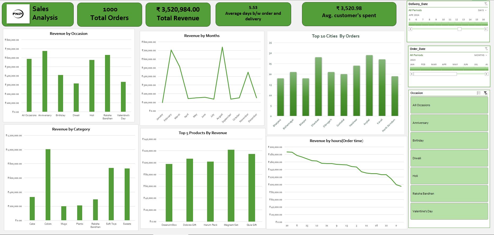

# 🧾 FNP Sales Analysis – Retail Sales Dashboard (Excel Project)

Analyzing customer behavior, revenue trends, and product performance to improve marketing and operational decisions using **Microsoft Excel** and **Power Query**.

---

## 📌 Table of Contents
- Overview  
- Business Problem  
- Dataset  
- Tools & Technologies  
- Project Structure  
- Data Cleaning & Preparation  
- Exploratory Data Analysis (EDA)  
- Key Insights & Findings  
- Dashboard  
- How to Use This Project  
- Final Recommendations  
- Author & Contact  

---

## 🧭 Overview
This project evaluates **FNP (Ferns N Petals)** sales data to identify key trends, customer preferences, and high-performing categories.  
A **fully interactive Excel Dashboard** was created using Power Query, Pivot Tables, and Slicers to visualize performance metrics and generate business insights.

---

## 💼 Business Problem
FNP wanted to analyze their sales data to:
- Understand **which occasions and categories** bring the most revenue  
- Identify **top-performing cities and products**  
- Measure **average customer spend** and delivery time  
- Visualize sales patterns across **months, occasions, and time of day**  

The goal is to optimize marketing campaigns, stock planning, and customer targeting.

---

## 🗂️ Dataset
The dataset includes three CSV files:
- `customers.csv` → Customer details  
- `orders.csv` → Order, date, payment, and delivery data  
- `products.csv` → Product category and pricing info  

Data files are located in the `/data` folder.

---

## 🧰 Tools & Technologies
- **Microsoft Excel** – Dashboard design, analysis, and data modeling  
- **Power Query** – Data transformation and merging  
- **Pivot Tables & Charts** – Visual analytics  
- **Data Validation & Slicers** – Interactive filtering  

---

## 📁 Project Structure
```
fnp-sales-analysis-dashboard/
│
├── dashboard/
│   └── fnp_sale_project.xlsx
│
├── images/
│   └── fnp_sales_dashboard.png
│
├── data/
│   ├── customers.csv
│   ├── orders.csv
│   └── products.csv
│
├── README.md
├── .gitignore
└── FNP Sales Report.pdf
```

---

## 🧹 Data Cleaning & Preparation
Performed in **Excel Power Query**:
- Converted date fields to proper formats  
- Merged customer, order, and product tables  
- Removed duplicates and null values  
- Standardized column names and data types  
- Calculated new columns like:
  - `Revenue = Quantity × Price`
  - `Delivery_Days = Delivery_Date - Order_Date`
  - `Avg_Spent_Per_Customer`

---

## 🔍 Exploratory Data Analysis (EDA)
Sample KPIs (calculated during analysis):
- Total Orders: **1,000**  
- Total Revenue: **₹ 3,520,984**  
- Average Customer Spent: **₹ 3,520.98**  
- Avg. Days Between Order & Delivery: **5.53 days**

Visual patterns explored:
- Revenue by Occasion, Month, and Category  
- City-wise order distribution  
- Top 5 products by revenue  
- Revenue by order time  

---

## 💡 Key Insights & Findings
- 🎉 **Anniversary** was the top revenue-generating occasion.  
- 🧸 **Soft Toys** & **Sweets** categories performed best.  
- 📍 Highest orders came from **Imphal** and **Kavali** cities.  
- 📆 Peak months: **February** (Valentine’s Day) & **August** (Raksha Bandhan).  
- ⏱️ Average delivery time: ~5.5 days — opportunity for logistics improvement.  

---

## 📊 Dashboard
The Excel dashboard includes:
- KPI Cards (Total Orders, Revenue, Avg. Spend, Delivery Days)  
- Revenue by Occasion, Month, and Category  
- Top 10 Cities by Orders  
- Top 5 Products by Revenue  
- Revenue by Hour (Order Time)  
- Interactive Filters for Occasion, Order Date, and Delivery Date  



---

## 🧾 How to Use This Project
1. Download `fnp_sale_project.xlsx` from `/dashboard`  
2. Open in Microsoft Excel (latest version recommended)  
3. Enable Editing and Filters  
4. Explore dashboard insights using slicers and charts  

---

## 🎯 Final Recommendations
- Focus marketing around **Anniversary & Valentine’s Day**  
- Boost **Soft Toys** and **Sweets** category promotions  
- Improve delivery timelines during festive months  
- Analyze **city-level trends** for better stock distribution  

---

## 👨‍💻 Author & Contact
**Anand Yadav**  
 📧 yanand7977@gmail.com
 📅 Project Year: 2025

---

